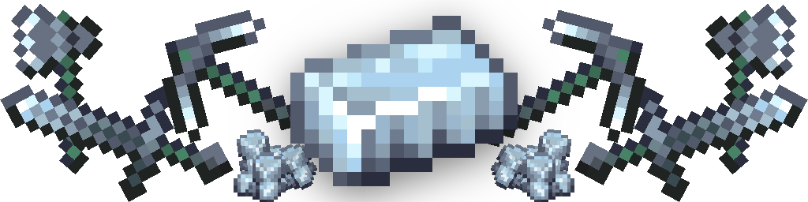

# Mithril

A minecraft mod that adds a simple new material, Mithril. It works purely serverside thanks to [Patbox's Polymer](https://github.com/Patbox/polymer). Version, let's say 0.1.0 :)

Each tool and armor when crafted is generated with a random enchantment with two levels higher than max. (This should be used with some kind of tweak to anvils so that the levels don't disappear when upgrading.)

# Acknowledgements

- Textures provided by [Macck209](https://github.com/Macck209)
- https://github.com/Patbox/polymer
